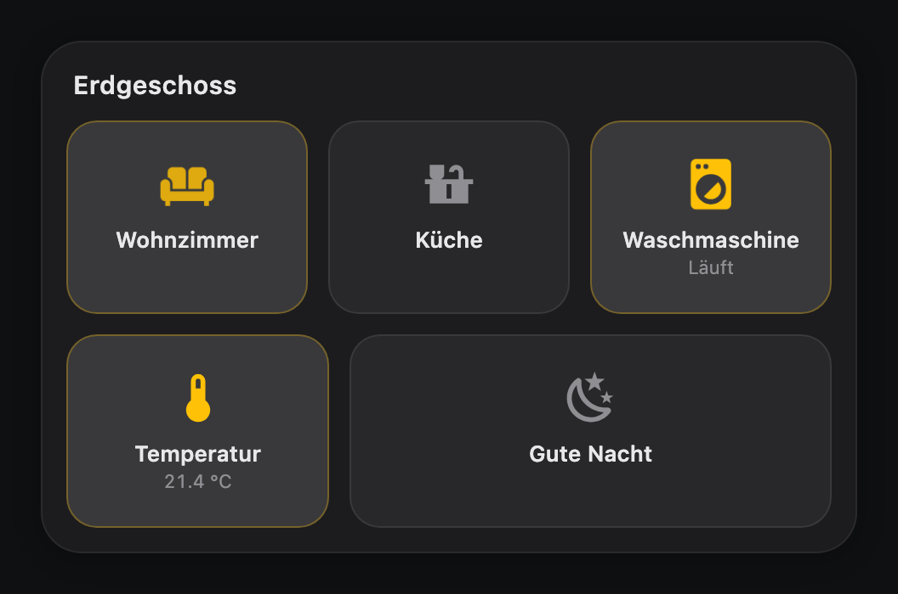
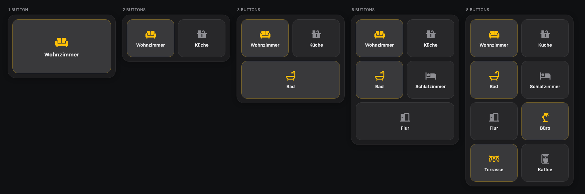
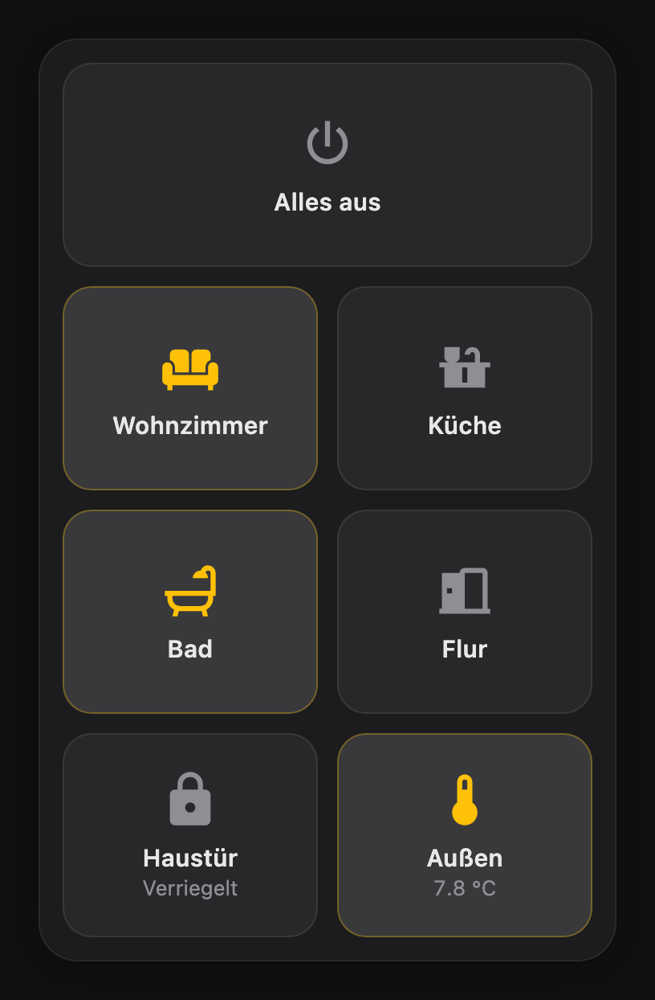
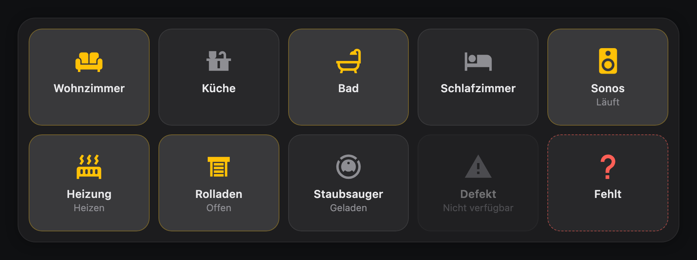

# Multi Button Card

A multi-button control card for Home Assistant, built for wall-mounted dashboards.

One file, no dependencies, no build step. The point of the card is that it looks
the same quality with three buttons as with twelve: the layout is computed from
the button count and the measured width, so there are no empty grid cells, no
orphan rows and no layout jumps.



---

## Contents

- [Installation](#installation)
- [Quick start](#quick-start)
- [How the layout works](#how-the-layout-works)
- [Configuration reference](#configuration-reference)
  - [Card options](#card-options)
  - [`layout`](#layout)
  - [`appearance`](#appearance)
  - [`button` (defaults for all buttons)](#button-defaults-for-all-buttons)
  - [Per-button options](#per-button-options)
  - [Actions](#actions)
  - [Icons](#icons)
  - [Animations](#animations)
- [Examples](#examples)
- [Behaviour details](#behaviour-details)
- [Development](#development)

---

## Installation

### HACS (custom repository)

1. HACS → three-dot menu → **Custom repositories**
2. Repository: `julezdean/lovelace-multi-button-card`, category **Dashboard**
3. Install **Multi Button Card**
4. Reload the browser (Ctrl/Cmd-Shift-R)

### Manual

1. Copy `multi-button-card.js` to `<config>/www/multi-button-card.js`
2. **Settings → Dashboards → three-dot menu → Resources → Add resource**
   - URL: `/local/multi-button-card.js`
   - Type: **JavaScript module**
3. Reload the browser

Confirm it loaded: the browser console prints `multi-button-card v1.0.0` on
startup.

---

## Quick start

```yaml
type: custom:multi-button-card
buttons:
  - name: Wohnzimmer
    icon: mdi:sofa
    entity: light.wohnzimmer

  - name: Küche
    icon: mdi:countertop
    entity: light.kueche

  - name: Gute Nacht
    icon: mdi:weather-night
    tap_action:
      action: call-service
      service: scene.turn_on
      target:
        entity_id: scene.gute_nacht
```

A button with an `entity` and no `tap_action` toggles that entity and opens
more-info on hold. That is usually all you need.

---

## How the layout works

The card does not use a fixed grid. It measures its own width, derives a column
count, and then splits the buttons into rows that are as equal as possible.

```
columns = clamp(round(width / layout.column_width), 1, min(max_columns, buttons))
rows    = ceil(total weight / columns)
```

Rows are filled front-heavy, so a leftover button ends up as a full-width button
at the bottom rather than as a lonely cell next to empty space:

| Buttons | Columns | Rows |
|---|---|---|
| 1 | 1 | `[1]` |
| 3 | 2 | `[2, 1]` |
| 5 | 2 | `[2, 2, 1]` |
| 7 | 3 | `[3, 2, 2]` — never `[3, 3, 1]` |
| 8 | 2 | `[2, 2, 2, 2]` |



Button height follows the column width — `clamp(min_button_size, width / 1.25,
max_button_size)` — which is why a single button does not become a huge tile and
twelve buttons stay tappable.

`colspan` participates in the same calculation: a button with `colspan: 2`
occupies two slots and grows to twice the width of its neighbours.

Below 96 px of button height the button switches to a horizontal inner layout —
icon left, text right — instead of squeezing the label. This keeps a card with
ten buttons in a narrow column readable rather than cramped. The switch depends
only on the computed cell height, so it cannot oscillate.

Within a row, all buttons reserve room for the state line as soon as one of them
uses it. Otherwise the icons and names of neighbouring buttons would sit at
different heights, which is what makes a card look restless. Rows where nobody
shows a state stay vertically centred.

Portrait and landscape are the same mechanism, only with a different measured
width:

| Portrait (360 px column) | Landscape (900 px panel) |
|---|---|
|  |  |

The landscape image also shows the two error states: `sensor.kaputt` is
`unavailable` (dimmed), and `light.gibt_es_nicht` does not exist (dashed
outline). Neither takes the rest of the card down.

---

## Configuration reference

### Card options

| Option | Type | Default | Description |
|---|---|---|---|
| `type` | string | — | `custom:multi-button-card` |
| `title` | string | — | Optional heading above the buttons |
| `buttons` | list | — | **Required**, at least one entry |
| `layout` | map | see below | Layout engine settings |
| `appearance` | map | see below | Card surface |
| `button` | map | see below | Defaults inherited by every button |
| `animation` | map | see below | Default animation for every button |

### `layout`

| Option | Type | Default | Description |
|---|---|---|---|
| `mode` | `auto` \| `grid` \| `fixed` | `auto` | `auto` measures; `grid`/`fixed` use `columns` |
| `columns` | number \| `auto` | `auto` | Column count. A number implies `mode: grid` |
| `gap` | number \| string | `12` | Space between buttons |
| `min_button_size` | number | `88` | Lower bound for button height (px) |
| `max_button_size` | number | `170` | Upper bound for button height (px) |
| `column_width` | number | `172` | Column width the auto mode aims for |
| `max_columns` | number | `6` | Hard ceiling regardless of width |

Widen the buttons by *raising* `column_width` — that produces fewer, larger
columns.

### `appearance`

| Option | Type | Default | Description |
|---|---|---|---|
| `background` | CSS colour | HA card background | Card surface |
| `radius` | number \| string | `24` | Card corner radius |
| `padding` | number \| string | `14` | Inner padding |
| `shadow` | boolean | `true` | Card shadow |

### `button` (defaults for all buttons)

Every key here can also be set on an individual button, where it wins.

| Option | Type | Default | Description |
|---|---|---|---|
| `radius` | number \| string | `18` | Button corner radius |
| `background` | CSS colour | subtle overlay | Inactive background |
| `active_background` | CSS colour | slightly brighter | Active background |
| `active_color` | CSS colour | `--state-active-color` | Accent for icon and outline |
| `icon_color` | CSS colour | secondary text | Inactive icon colour |
| `icon_size` | number \| string | derived from height | Fixed icon size |
| `label_size` | number \| string | derived from height | Fixed label size |
| `show_name` | boolean | `true` | Show the name line |
| `show_state` | boolean \| `auto` | `auto` | See below |
| `press_effect` | `scale` \| `fade` \| `none` | `scale` | Touch feedback |

**`show_state: auto`** shows the state only for domains whose state carries a
value — `sensor`, `climate`, `cover`, `media_player`, `lock`, … For a light or a
switch the colour already says everything, so the extra line is left out. Set
`true` or `false` to override.

### Per-button options

| Option | Type | Description |
|---|---|---|
| `name` | string \| `false` | Label. Defaults to the entity's friendly name |
| `label` | string | Secondary line when no state is shown |
| `icon` | string \| map | See [Icons](#icons) |
| `entity` | string | Entity for state, colour and default actions |
| `colspan` | number | Slots this button occupies (default `1`) |
| `size` | `large` \| `wide` \| `full` | Aliases for `colspan` |
| `confirmation` | boolean \| `{ text }` | Two-step confirmation, see below |
| `state_display` | string | Template for the state line, see below |
| `tap_action` / `hold_action` / `double_tap_action` | map | See [Actions](#actions) |
| `animation` | map \| string | See [Animations](#animations) |

**`confirmation`** does not open a modal. The first tap arms the button — it
turns red and shows the confirmation text — and a second tap within four
seconds runs the action. Nothing happens if you walk away. The built-in text is
English (`Tap again to confirm`), so set `confirmation.text` if your dashboard
is in another language.

**`state_display`** is a small placeholder syntax, not Jinja:

```yaml
state_display: "{{state}} · {{attributes.current_temperature}} °C"
```

Available: `{{state}}` (formatted), `{{raw_state}}`, `{{name}}`, and any
attribute by name or as `{{attributes.x}}`.

### Actions

Home Assistant's own action grammar. `tap_action`, `hold_action` and
`double_tap_action` all accept:

| `action` | Additional keys |
|---|---|
| `toggle` | `entity` (falls back to the button's) |
| `more-info` | `entity` |
| `call-service` / `perform-action` | `service`, `data`, `target` |
| `navigate` | `navigation_path` |
| `url` | `url_path`, `new_tab` |
| `assist` | `pipeline_id`, `start_listening` |
| `fire-dom-event` | any keys, emitted as `ll-custom` |
| `none` | — |

Defaults: `tap_action` toggles the entity, `hold_action` opens more-info,
`double_tap_action` is `none`. A button without an entity and without an
explicit action does nothing rather than erroring.

The shorthand from HA's own docs works too:

```yaml
action:
  service: light.turn_on
  target:
    entity_id: light.wohnzimmer
```

`toggle` handles domains without a `toggle` service correctly: locks are locked
or unlocked according to their state, buttons are pressed, scenes and scripts
are turned on.

### Icons

```yaml
icon: mdi:lightbulb
```

State-dependent, keyed by state value:

```yaml
icon:
  "on": mdi:lightbulb
  "off": mdi:lightbulb-outline
  default: mdi:help-circle-outline
```

Quote `on` and `off` — unquoted, YAML turns them into booleans. The card accepts
both spellings anyway, but quoting is clearer.

Without an `icon`, the card renders `<ha-state-icon>`, so you get the same icon
Home Assistant would pick for that entity.

### Animations

```yaml
animation:
  type: pulse
  duration: 2s
  intensity: 0.8
  when: "on"
```

Types: `none`, `pulse`, `breathe`, `bounce`, `spin`, `shake`, `glow`, `blink`,
`wobble`. An unknown type degrades to `none` instead of breaking the card.

`intensity` (0–3, default 1) scales the amplitude. `duration` accepts `2s` or a
bare number.

**`when`** decides when the animation runs:

| Value | Animates when |
|---|---|
| `active` *(default)* | the entity is on / open / playing / … |
| `inactive` | the entity is off |
| `always` | always |
| `"on"`, `"heat"`, … | the state matches exactly |
| `["heating", "cooling"]` | the state matches any entry |
| `{ above: 25 }` | numeric state above 25 |
| `{ above: 10, below: 20 }` | numeric state within the range |
| `unavailable` | the entity is unavailable |

`state:` is accepted as a synonym for `when:`.

Set on the card, it applies to every button; set on a button, it overrides the
type while still inheriting the duration:

```yaml
animation:
  type: breathe
  duration: 3s

buttons:
  - entity: binary_sensor.waschmaschine
    animation:
      type: pulse        # duration stays 3s
```

Animations are pure CSS and honour `prefers-reduced-motion: reduce`.

---

## Examples

Three complete configurations are in [`examples/`](examples/):

| File | What it shows |
|---|---|
| [`small-wallmount.yaml`](examples/small-wallmount.yaml) | Three buttons, minimal configuration |
| [`large-dashboard.yaml`](examples/large-dashboard.yaml) | Ten buttons, tuned layout, confirmation |
| [`mixed-dashboard.yaml`](examples/mixed-dashboard.yaml) | Entities, navigation, service calls, animations |

---

## Behaviour details

**Touch.** A plain tap fires immediately on release. The 250 ms double-tap
window is opened *only* when a `double_tap_action` is actually configured —
responsiveness on a wall tablet matters more than universal double-tap support.
Hold fires at 500 ms. Dragging more than 12 px cancels the gesture, so scrolling
a dashboard does not trigger buttons.

**Performance.** The DOM is built once. A `hass` update compares one signature
string per button and touches the DOM only for buttons that actually changed.
The `ResizeObserver` reads width only — reading height would feed the layout
back into itself — and re-lays out only when the column count or button height
actually changes.

**Accessibility.** Buttons are real `<button>` elements with `aria-label` and
`aria-pressed`, reachable and operable by keyboard, with a visible focus ring.
Nothing depends on hover.

**Themes.** All colours come from Home Assistant theme variables
(`--ha-card-background`, `--primary-text-color`, `--state-active-color`, …), so
light and dark themes both work. Every `color-mix()` has a plain `rgba()`
fallback in front of it for the older webviews found on wall tablets.

**Errors.** A misconfigured button shows a dashed outline; the rest of the card
keeps working. A card without `buttons` shows a readable error instead of a
blank space.

---

## Development

```bash
npm test                 # layout engine, config normalisation, animation conditions
./tools/screenshots.sh   # regenerate docs/images/ from the demo harness
```

`tools/demo/` is a harness that imports the real `multi-button-card.js` with a
mock `hass` object and stubs for `<ha-icon>` / `<ha-state-icon>`, so the images
in this README always show the current code. Serve the repo root and open
`tools/demo/index.html?scene=overview` (scenes: `overview`, `counts`,
`portrait`, `landscape`).

The window sizes in `tools/screenshots.sh` are measured, not guessed — if you
add a button to a scene, re-measure and update them.
