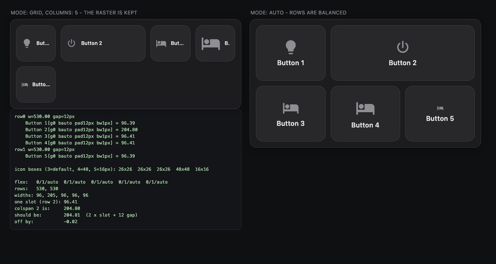
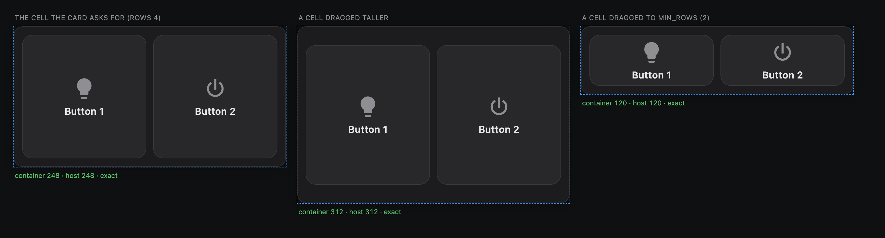
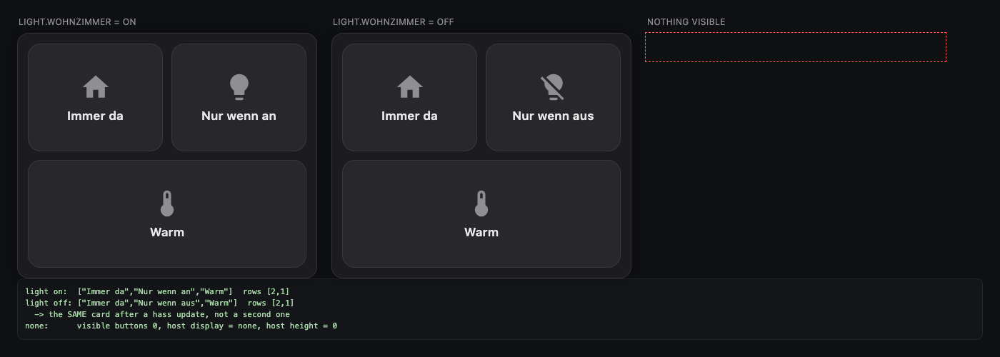

# Multi Button Card

A multi-button control card for Home Assistant, built for wall-mounted dashboards.

One file, no dependencies, no build step. The point of the card is that it looks
the same quality with three buttons as with twelve: the layout is computed from
the button count and the measured width, so there are no empty grid cells, no
orphan rows and no layout jumps.

[](https://github.com/julezdean/lovelace-multi-button-card/actions/workflows/ci.yml)
[](https://github.com/hacs/integration)
[](https://github.com/julezdean/lovelace-multi-button-card/releases)

[](https://my.home-assistant.io/redirect/hacs_repository/?owner=julezdean&repository=lovelace-multi-button-card&category=plugin)


---

## Contents

- [Installation](#installation)
- [Quick start](#quick-start)
- [How the layout works](#how-the-layout-works)
- [Configuration reference](#configuration-reference)
  - [Card options](#card-options)
  - [`layout`](#layout)
  - [`appearance`](#appearance)
  - [`button` (defaults for all buttons)](#button-defaults-for-all-buttons)
  - [Per-button options](#per-button-options)
  - [Templates](#templates)
  - [Per-button styling](#per-button-styling)
  - [Visibility](#visibility)
  - [Actions](#actions)
  - [Icons](#icons)
  - [Animations](#animations)
- [The visual editor](#the-visual-editor)
- [Examples](#examples)
- [Behaviour details](#behaviour-details)
- [Development](#development)

---

## Installation

### HACS

[](https://my.home-assistant.io/redirect/hacs_repository/?owner=julezdean&repository=lovelace-multi-button-card&category=plugin)

That button opens the repository straight in your HACS. Install it there, then
reload the browser (Ctrl/Cmd-Shift-R).

Adding it by hand instead:

1. HACS → three-dot menu → **Custom repositories**
2. Repository: `julezdean/lovelace-multi-button-card`, category **Dashboard**
3. Install **Multi Button Card**
4. Reload the browser (Ctrl/Cmd-Shift-R)

### Manual

1. Copy `multi-button-card.js` to `<config>/www/multi-button-card.js`
2. **Settings → Dashboards → three-dot menu → Resources → Add resource**
   - URL: `/local/multi-button-card.js`
   - Type: **JavaScript module**
3. Reload the browser

Confirm it loaded: the browser console prints `multi-button-card v1.6.0` on
startup.

---

## Quick start

```yaml
type: custom:multi-button-card
buttons:
  - name: Wohnzimmer
    icon: mdi:sofa
    entity: light.wohnzimmer

  - name: Küche
    icon: mdi:countertop
    entity: light.kueche

  - name: Gute Nacht
    icon: mdi:weather-night
    tap_action:
      action: call-service
      service: scene.turn_on
      target:
        entity_id: scene.gute_nacht
```

A button with an `entity` and no `tap_action` toggles that entity and opens
more-info on hold. That is usually all you need.

---

## How the layout works

The card does not use a fixed grid. It measures its own width, derives a column
count, and then splits the buttons into rows that are as equal as possible.

```
columns = clamp(round(width / layout.column_width), 1, min(max_columns, buttons))
rows    = ceil(total weight / columns)
```

Rows are filled front-heavy, so a leftover button ends up as a full-width button
at the bottom rather than as a lonely cell next to empty space:

| Buttons | Columns | Rows |
|---|---|---|
| 1 | 1 | `[1]` |
| 3 | 2 | `[2, 1]` |
| 5 | 2 | `[2, 2, 1]` |
| 7 | 3 | `[3, 2, 2]` — never `[3, 3, 1]` |
| 8 | 2 | `[2, 2, 2, 2]` |


Button height follows the column width — `clamp(min_button_size, width / 1.25,
max_button_size)` — which is why a single button does not become a huge tile and
twelve buttons stay tappable.

### Slots, columns and the two modes

Three options answer three different questions:

| | |
|---|---|
| `colspan` (editor: *Width in slots*) | how many slots one button occupies |
| `layout.columns` | how many slots a row holds |
| `layout.max_columns` | the ceiling for the count `auto` works out itself |

A row is a grid of equal tracks and a wide button spans several of them, so
`colspan: 2` is exactly as wide as two single buttons plus the gap between them
— not merely "about twice as wide".

The two modes differ in what happens once the slots are counted. `auto`
balances the rows, which is what keeps a leftover button from sitting alone
beside empty space. `grid` keeps the raster you asked for and fills each row to
capacity, even if the last one ends up half empty:

```yaml
layout: { mode: grid, columns: 5 }
buttons: [B1, B2 (colspan 2), B3, B4, B5]
```

```
mode: grid                         mode: auto
┌────┬─────────┬────┬────┐         ┌───────────┬───────────┐
│ B1 │   B2    │ B3 │ B4 │         │    B1     │    B2     │
├────┼─────────┴────┴────┘         ├───────┬───┴───┬───────┤
│ B5 │                             │  B3   │  B4   │  B5   │
└────┘                             └───────┴───────┴───────┘
```



Below 96 px of button height the button switches to a horizontal inner layout —
icon left, text right — instead of squeezing the label. This keeps a card with
ten buttons in a narrow column readable rather than cramped. The switch depends
only on the computed cell height, so it cannot oscillate.

Within a row, all buttons reserve room for the state line as soon as one of them
uses it. Otherwise the icons and names of neighbouring buttons would sit at
different heights, which is what makes a card look restless. Rows where nobody
shows a state stay vertically centred.

In the sections view the card asks for a grid cell that fits its buttons, and
takes whatever height it is actually given: it fills a cell dragged taller, and
shrinks the buttons down to the touch-target floor in a cell dragged to
`min_rows` rather than clipping them.



Portrait and landscape are the same mechanism, only with a different measured
width:

| Portrait (360 px column) | Landscape (900 px panel) |
|---|---|
|  |  |

The landscape image also shows the two error states: `sensor.kaputt` is
`unavailable` (dimmed), and `light.gibt_es_nicht` does not exist (dashed
outline). Neither takes the rest of the card down.

---

## Configuration reference

### Card options

| Option | Type | Default | Description |
|---|---|---|---|
| `type` | string | — | `custom:multi-button-card` |
| `title` | string | — | Optional heading above the buttons |
| `buttons` | list | — | **Required**, at least one entry |
| `layout` | map | see below | Layout engine settings |
| `appearance` | map | see below | Card surface |
| `button` | map | see below | Defaults inherited by every button |
| `animation` | map | see below | Default animation for every button |

### `layout`

| Option | Type | Default | Description |
|---|---|---|---|
| `mode` | `auto` \| `grid` | `auto` | `auto` works the count out from the width; `grid` takes it from `columns` |
| `columns` | number \| `auto` | `auto` | **`grid` only.** Column count. A number implies `mode: grid` |
| `column_width` | number | `172` | **`auto` only.** The column width the automatic count aims for |
| `max_columns` | number | `6` | **`auto` only.** Ceiling for the automatic count |
| `gap` | number \| string | `12` | Space between buttons |
| `min_button_size` | number | `88` | Lower bound for button height (px) |
| `max_button_size` | number | `170` | Upper bound for button height (px) |

In `auto`, widen the buttons by *raising* `column_width` — that produces fewer,
larger columns, and `max_columns` caps the result.

`max_columns` deliberately does **not** apply in `grid` mode: there the count is
stated outright, and a second ceiling on top of it would only be a way to
silently ignore what was asked for. An explicit count is capped at 12, beyond
which nothing is a touch target any more. (`mode: fixed` is accepted as an old
spelling of `grid`.)

### `appearance`

The card renders a real `<ha-card>`, so its surface, corner radius, outline and
shadow come from the active theme. These options override the theme where you
want them to; left unset, they stay out of its way.

| Option | Type | Default | Description |
|---|---|---|---|
| `background` | CSS colour | from the theme | Sets `--ha-card-background` |
| `radius` | number \| string | from the theme | Sets `--ha-card-border-radius` |
| `padding` | number \| string | `14` | Inner padding — the card's own, no theme equivalent |
| `shadow` | boolean | from the theme | `false` sets `--ha-card-box-shadow: none` |

### `button` (defaults for all buttons)

Every key here can also be set on an individual button, where it wins.

| Option | Type | Default | Description |
|---|---|---|---|
| `radius` | number \| string | `18` | Button corner radius |
| `background` | CSS colour | subtle overlay | Inactive background |
| `active_background` | CSS colour | slightly brighter | Active background |
| `active_color` | CSS colour | `--state-active-color` | Accent for icon and outline |
| `icon_color` | CSS colour | secondary text | Inactive icon colour |
| `icon_size` | number \| string | derived from height | Fixed icon size |
| `label_size` | number \| string | derived from height | Fixed label size |
| `show_name` | boolean | `true` | Show the name line |
| `show_state` | boolean \| `auto` | `auto` | See below |
| `press_effect` | `scale` \| `fade` \| `none` | `scale` | Touch feedback |

**`show_state: auto`** shows the state only for domains whose state carries a
value — `sensor`, `climate`, `cover`, `media_player`, `lock`, … For a light or a
switch the colour already says everything, so the extra line is left out. Set
`true` or `false` to override.

### Per-button options

| Option | Type | Description |
|---|---|---|
| `name` | string \| `false` | Label. Defaults to the entity's friendly name |
| `label` | string | Secondary line when no state is shown |
| `icon` | string \| map | See [Icons](#icons) |
| `entity` | string | Entity for state, colour and default actions |
| `colspan` | number | Slots this button occupies (default `1`) |
| `size` | `large` \| `wide` \| `full` | Aliases for `colspan` |
| `confirmation` | boolean \| `{ text }` | Two-step confirmation, see below |
| `visibility` | list | Conditions under which the button is shown, see [Visibility](#visibility) |
| `style` | string | CSS declarations for this button, see [Per-button styling](#per-button-styling) |
| `active_color` | CSS colour | Accent for this button's icon and outline when active |
| `icon_color`, `background`, `active_background` | CSS colour | Per-button overrides of the card defaults |

`active_background` takes precedence over `background` while the button is on.
A button given only a `background` keeps that colour in both states — the
active state then shows on its icon and outline rather than on the surface.
| `state_display` | string | Template for the state line, see below |
| `tap_action` / `hold_action` / `double_tap_action` | map | See [Actions](#actions) |
| `animation` | map \| string | See [Animations](#animations) |

**`confirmation`** does not open a modal. The first tap arms the button — it
turns red and shows the confirmation text — and a second tap within four
seconds runs the action. Nothing happens if you walk away. The built-in text is
English (`Tap again to confirm`), so set `confirmation.text` if your dashboard
is in another language.

**`state_display`** is a small placeholder syntax, not Jinja:

```yaml
state_display: "{{state}} · {{attributes.current_temperature}} °C"
```

Available: `{{state}}` (formatted), `{{raw_state}}`, `{{name}}`, and any
attribute by name or as `{{attributes.x}}`.

### Templates

Presentation fields can carry JavaScript, in the `[[[ ... ]]]` form that
`custom:button-card` established:

```yaml
buttons:
  - entity: binary_sensor.alle_fenster
    name: Fenster
    label: |
      [[[
        const offen = entity.attributes.anzahl_offen ?? 0;
        return entity.state === 'on' ? `${offen}` : '';
      ]]]
```

Available inside a template: `entity` (this button's state object, or
`undefined`), `states`, `user`, `hass`, and `variables` (from a `variables:`
block on the card).

A template filling the whole string returns its value as-is, so it can yield a
number or a boolean. One embedded in text is substituted into it:
`label: "Status: [[[ return entity.state ]]] now"`.

Templated fields: `name`, `label`, `state_display`, `icon`, `style`,
`color`, `active_color`, `icon_color`, `background`, `active_background`,
`show_name`, `show_state`. Deliberately **not** templated: `entity` (it is what
state tracking hangs on), `colspan` (it would rebuild the layout on every
update) and the actions (structure, not appearance).

A template that throws costs its own field and nothing else — the button keeps
rendering, and the error goes to the browser console.

Templates are evaluated JavaScript from the dashboard's configuration, the same
trade-off every templating card in this ecosystem makes. Your own config is
yours; be as careful with a copied one as you would be with any code.

### Per-button styling

Each button takes a `style` of CSS declarations — not a rule, just what would
go inside one — and it is templated like everything else:

```yaml
- entity: binary_sensor.alle_fenster
  style: |
    [[[
      return entity.attributes.anzahl_nicht_verfuegbar > 0
        ? 'border: 2px solid var(--error-color)'
        : '';
    ]]]
```

Colours are per button too — `active_color` is the accent its icon and outline
take when active, and like everything else it can be a template:

```yaml
- entity: sensor.wohnzimmer_temperatur
  active_color: |
    [[[ return Number(entity.state) > 20 ? '#ff9f43' : '#54a0ff' ]]]
```

In the editor these live under **Colours** on the button's page.

**On a translucent card** — a glass theme setting `ha-card { background:
rgba(...) }` — the buttons are translucent too, because their own surface is a
light overlay rather than a colour. Give them one and they stop showing the
wallpaper through:

```yaml
button:
  background: "#2a2724"
  active_background: "#3a332c"   # optional, if you want a distinct "on" tone
```

That is preferable to forcing it with `card_mod` and `!important`, which would
also override `active_background` and flatten the on/off difference.

**Themes** reach this card like any other. Because it renders a real `ha-card`,
a `card-mod-card` block in your theme applies to it — `ha-card { ... }` selects
something here. Earlier versions drew their own surface instead, which is why
this card was the one that ignored the theme.

**card_mod** works too, and does not need anything per button. It targets the
card element and injects into this card's shadow root, so a selector reaches a
single button directly. Every button carries the attributes to find it by:

| Attribute | |
|---|---|
| `data-entity` | the button's entity |
| `data-domain` | that entity's domain |
| `data-state` | its current state, kept up to date |
| `data-active` | `true` / `false`, HA's active semantics |
| `data-index` | position in the config |
| `data-name` | the configured name, when it is not a template |

```yaml
card_mod:
  style: |
    .btn[data-entity="binary_sensor.alle_fenster"][data-state="on"] {
      border: 2px solid var(--error-color) !important;
    }
```

There is no `card_mod` *per button*: card-mod knows cards, not the elements
inside them. The selector above is the equivalent, and `style` is the option
that needs no extra integration at all.

### Visibility

A button can be shown only under certain conditions, using Home Assistant's own
condition grammar — the same one `visibility:` uses in sections and the
conditional card:

```yaml
buttons:
  - name: Waschmaschine
    icon: mdi:washing-machine
    entity: binary_sensor.waschmaschine
    visibility:
      - condition: state
        entity: binary_sensor.waschmaschine
        state: "on"
```

A list means **all** of its conditions must hold. Supported:

| `condition` | Keys |
|---|---|
| `state` | `entity`, `state` or `state_not` (a value or a list of values) |
| `numeric_state` | `entity`, `above`, `below`, optional `attribute` |
| `screen` | `media_query` |
| `user` | `users` (a list of user ids) |
| `and` / `or` / `not` | `conditions` |

`conditions:` is accepted as a synonym for `visibility:`, since that is the
spelling the conditional card uses.

Two details worth knowing:

- **Hiding a button re-runs the layout.** The remaining buttons are re-balanced
  rather than leaving a hole, so a card whose four buttons drop to three ends up
  as two plus one, not as three buttons and a gap.
- **If every button is hidden, the card hides itself**, the way a conditional
  card does, instead of leaving an empty surface on the dashboard.
- An **unknown condition type counts as met**. A typo leaves the button where it
  is rather than making it disappear with no clue as to why.

`screen` conditions are watched with a media query listener, so rotating a
tablet re-evaluates them; nothing needs to be reloaded.



Each button's page also has a `{}` button that swaps the form for the raw YAML
of that one button — the same affordance as elsewhere in Lovelace. It is the
way to reach what a form cannot express: templates, state-keyed icon maps, and
anything a later version adds. Invalid YAML is not written back, so the card
does not fall apart while you type.

In the visual editor, conditions are edited on a button's page under
**Visibility**, using Home Assistant's own conditions editor — the same control
the conditional card and section visibility use. It is loaded on demand; if it
cannot be loaded, the section falls back to a note and the conditions stay
editable in YAML, untouched by anything else you change.

### Actions

Home Assistant's own action grammar. `tap_action`, `hold_action` and
`double_tap_action` all accept:

| `action` | Additional keys |
|---|---|
| `toggle` | `entity` (falls back to the button's) |
| `more-info` | `entity` |
| `call-service` / `perform-action` | `service`, `data`, `target` |
| `navigate` | `navigation_path` |
| `url` | `url_path`, `new_tab` |
| `assist` | `pipeline_id`, `start_listening` |
| `fire-dom-event` | any keys, emitted as `ll-custom` |
| `none` | — |

Defaults: `tap_action` toggles the entity, `hold_action` opens more-info,
`double_tap_action` is `none`. A button without an entity and without an
explicit action does nothing rather than erroring.

The shorthand from HA's own docs works too:

```yaml
action:
  service: light.turn_on
  target:
    entity_id: light.wohnzimmer
```

`toggle` handles domains without a `toggle` service correctly: locks are locked
or unlocked according to their state, buttons are pressed, scenes and scripts
are turned on.

### Icons

```yaml
icon: mdi:lightbulb
```

State-dependent, keyed by state value:

```yaml
icon:
  "on": mdi:lightbulb
  "off": mdi:lightbulb-outline
  default: mdi:help-circle-outline
```

Quote `on` and `off` — unquoted, YAML turns them into booleans. The card accepts
both spellings anyway, but quoting is clearer.

Without an `icon`, the card renders `<ha-state-icon>`, so you get the same icon
Home Assistant would pick for that entity.

### Animations

```yaml
animation:
  type: pulse
  duration: 2s
  intensity: 0.8
  when: "on"
```

Types: `none`, `pulse`, `breathe`, `bounce`, `spin`, `shake`, `glow`, `blink`,
`wobble`. An unknown type degrades to `none` instead of breaking the card.

`intensity` (0–3, default 1) scales the amplitude. `duration` accepts `2s` or a
bare number.

**`when`** decides when the animation runs:

| Value | Animates when |
|---|---|
| `active` *(default)* | the entity is on / open / playing / … |
| `inactive` | the entity is off |
| `always` | always |
| `"on"`, `"heat"`, … | the state matches exactly |
| `["heating", "cooling"]` | the state matches any entry |
| `{ above: 25 }` | numeric state above 25 |
| `{ above: 10, below: 20 }` | numeric state within the range |
| `unavailable` | the entity is unavailable |

`state:` is accepted as a synonym for `when:`.

Set on the card, it applies to every button; set on a button, it overrides the
type while still inheriting the duration:

```yaml
animation:
  type: breathe
  duration: 3s

buttons:
  - entity: binary_sensor.waschmaschine
    animation:
      type: pulse        # duration stays 3s
```

Animations are pure CSS and honour `prefers-reduced-motion: reduce`.

---

## The visual editor

The card ships an editor, so it can be configured by clicking rather than by
writing YAML. Card options - layout, appearance, button defaults, animation -
are collapsible sections. The buttons are a list below them: click one to open
its own page with entity, icon, name, width, the three actions and its
animation; add, delete and reorder from the list.

Anything left at its default is not written to the config, so opening the
editor on a three-line YAML card does not turn it into fifty lines.

Two things stay YAML-only, because a form would make them worse rather than
better:

- **State-dependent icons** (`icon: { "on": ..., "off": ... }`). The editor
  keeps such a mapping when you edit other fields rather than flattening it to
  a single icon.
- **`state_display` placeholders** beyond plain text.

## Examples

Three complete configurations are in [`examples/`](examples/):

| File | What it shows |
|---|---|
| [`small-wallmount.yaml`](examples/small-wallmount.yaml) | Three buttons, minimal configuration |
| [`large-dashboard.yaml`](examples/large-dashboard.yaml) | Ten buttons, tuned layout, confirmation |
| [`mixed-dashboard.yaml`](examples/mixed-dashboard.yaml) | Entities, navigation, service calls, animations |

---

## Behaviour details

**Touch.** A plain tap fires immediately on release. The 250 ms double-tap
window is opened *only* when a `double_tap_action` is actually configured —
responsiveness on a wall tablet matters more than universal double-tap support.
Hold fires at 500 ms. Dragging more than 12 px cancels the gesture, so scrolling
a dashboard does not trigger buttons.

**Performance.** The DOM is built once. A `hass` update compares one signature
string per button and touches the DOM only for buttons that actually changed.
The `ResizeObserver` reads width only — reading height would feed the layout
back into itself — and re-lays out only when the column count or button height
actually changes.

**Accessibility.** Buttons are real `<button>` elements with `aria-label` and
`aria-pressed`, reachable and operable by keyboard, with a visible focus ring.
Nothing depends on hover.

**Themes.** All colours come from Home Assistant theme variables
(`--ha-card-background`, `--primary-text-color`, `--state-active-color`, …), so
light and dark themes both work. Every `color-mix()` has a plain `rgba()`
fallback in front of it for the older webviews found on wall tablets.

**Errors.** A misconfigured button shows a dashed outline; the rest of the card
keeps working. A card without `buttons` shows a readable error instead of a
blank space.

---

## Development

```bash
npm test                 # layout engine, config normalisation, animation conditions
./tools/screenshots.sh   # regenerate docs/images/ from the demo harness
```

`tools/demo/` is a harness that imports the real `multi-button-card.js` with a
mock `hass` object and stubs for `<ha-icon>`, `<ha-state-icon>` and `<ha-form>`,
so the images in this README always show the current code. Serve the repo root
and open `tools/demo/index.html?scene=overview`.

Scenes: `overview`, `counts`, `portrait`, `landscape`, `theme` and `opaque`
(how a card-mod theme reaches the card, and how to keep buttons opaque under
one), `constrained` (how the
card behaves in a sections grid cell), `colspan` (both layout modes with the
measured widths printed, so the span arithmetic is checkable), `visibility`, `compact`, `animations`,
`editor`.

The `editor` scene is for development only and is deliberately not
screenshotted: it renders against a stub, not against Home Assistant's real
`ha-form`, so an image of it would show a form that exists nowhere. It does
verify the wiring - schema read, `value-changed` handled, config written back,
`config-changed` emitted.

The window sizes in `tools/screenshots.sh` are measured, not guessed — if you
add a button to a scene, re-measure and update them.
